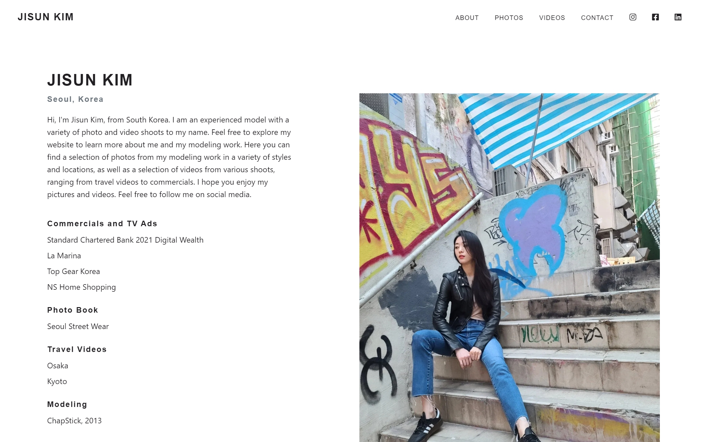
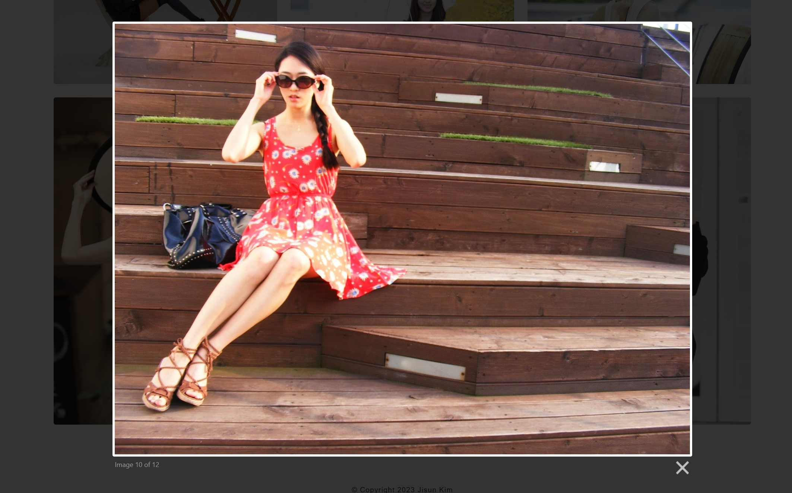

# Jisun Kim Official Website


## Description

Official portfolio website I designed and built for a client, a Korean model who wanted a website to showcase her modeling work and have a way for others to reach out to her for bookings or inquiries. By using the Sanity Content Management for the website, the client is able to manage her own content on the website.

## Jisun Kim Official Website Live Link

Please check out the live link for the Official Website here: [Jisun Kim Official Website](https://jisunkim.netlify.app/ "Jisun Kim Official Website")

## Table of Contents
* [Technologies Used](#Technologies-Used)
* [Development](#Development)
* [Screenshots](#Screenshots)

## Technologies Used

* React (Hooks)
* Sanity CMS
* React Router
* React Helmet
* React Bootstrap
* React Grid Gallery
* React Transition Group
* Lightbox2
* Framer Motion
* Material Icons
* CSS (CSS Modules)
* Animate.css
* Google Fonts
* Font Awesome
* Facebook Developer Tools (Sharing Debugger)
* Netlify

[Back To Top](#Table-of-Contents)

## Development

The client wanted a portfolio website to showcase her modeling work, particulary a selection of photos and videos of her work, as well as a way for others to reach out to her for bookings or inquiries. In order for her to have complete control of her content, I built the website using Sanity, a Content Management System. That way, the client would be able to manage her website's content on her own (e.g., adding and deleting photos and videos, as well as updating and editing text, such as her bio and samples of work on the About Page).

To enhance the showcasing of her photos, I used React Grid Gallery, an image gallery for React that has a design that fit with what the client wanted for the Photos Page. Since the client intends to have a number of photos on show, this gallery is exactly what she had in mind. Furthermore, I also added the use of Lightbox2 so that when a visitor to the site clicks on an image, you get a closer look at the clicked-on image while dimming and disabling the rest of the background, giving a stunning effect that goes well with the image gallery. For animations, I used Framer Motion in certain places, such as on the Landing Page, Photos Page, and Videos Page, for some nice animated effects.

To build the website, I used GROQ, Sanity's open-source query language, along with schemas that I created, so that the client would be able to add and fetch data from Sanity. The following example is taken from the Videos Page component in `Videos.js`. The code is put inside a `useEffect` so that the data is fetched when the component loads so that it displays on the page. In this case, the `videoUrl`. The `title` is also fetched. Here, it is an attribute used to describe the contents of the frame to people using assistive technology. Finally, the collection here is sorted in descending (`desc`) order.

```javascript
  useEffect(() => {
    sanityClient
      .fetch(
        `*[_type == "videos"] | order(_createdAt desc) {
          videoUrl,
          title
        }`
      )
      .then((data) => setVideoData(data))
      .catch(console.error);
  }, []);
  ```

The following is the schema in `videos.js` that goes with the Videos Page component:

```javascript
import {defineField, defineType} from 'sanity'

export default defineType({
  name: 'videos',
  title: 'Videos',
  type: 'document',
  fields: [
    defineField({
      name: 'videoUrl',
      title: 'Video URL',
      type: 'url',
    }),
    defineField({
      name: 'title',
      title: 'Title',
      type: 'string',
    }),
  ],
  preview: {
    select: {
      title: 'title',
      author: 'author.name',
      media: 'contactImage',
    },
  },
})

```

[Back To Top](#Table-of-Contents)

## Screenshots







[Back To Top](#Table-of-Contents)
